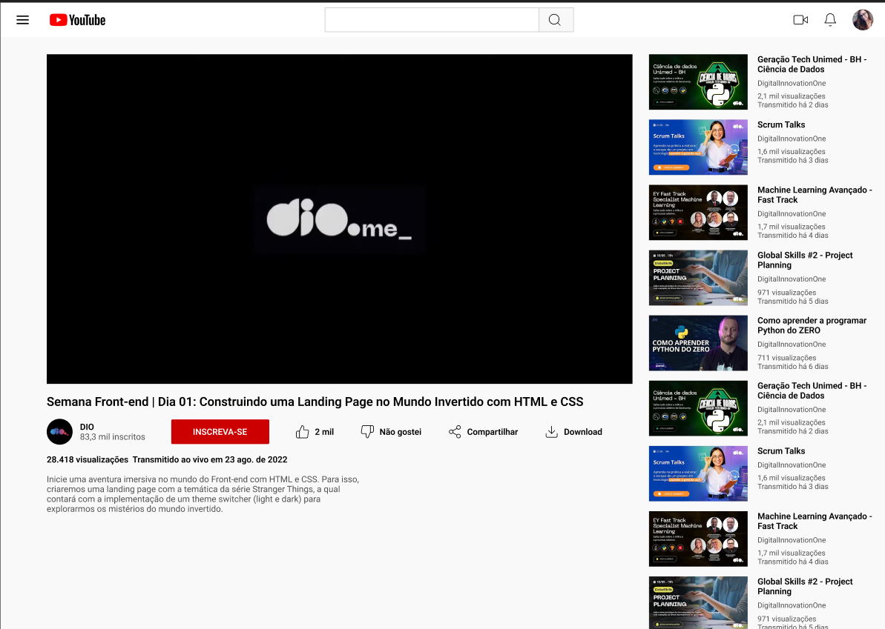

# Desafio 02: Criando um clone do Youtube com HTML e CSS

Bem vindo(a) ao segundo desafio da Trilha de CSS da DIO-Santander! Nela, você vai construir um clone da página do Youtube com HTML e CSS, colocando em prática os fundamentos do CSS,
as propriedades básicas da linguagem de estilização, trabalhar principalmente com o conceito de flexbox.

[Link do Figma](https://www.figma.com/file/lrRWUZPKnqMDZrSDJmZxUS/Desafio-de-Flexbox---DIO?node-id=0%3A1) contendo o protótipo do desafio para
que você possa se basear.

Para você realizar o desafio, criar o arquivo e **estilizar e construir** conforme o modelo do figma.

*Seja criativo(a) e dê a sua identidade para o Projeto. Lembre-se que para um(a) Profissional de Tecnologia é super importante ter um portfólio sólido e completo.*
